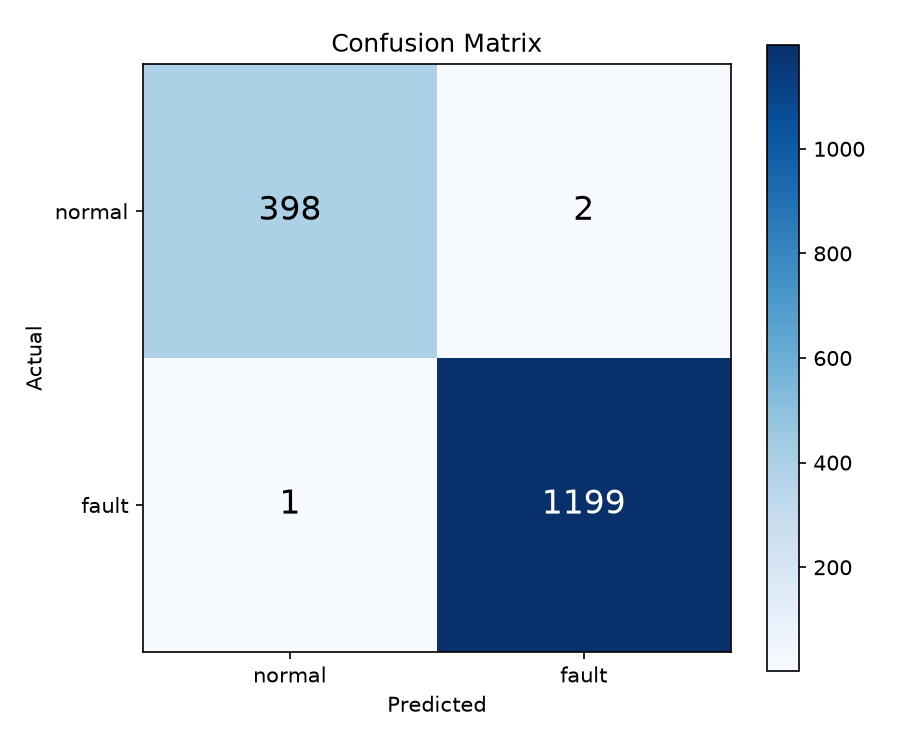

# Induction Motor Fault Detection

> Classify induction motor state (**Normal** vs **Fault**) using voltage, current, temperature, and vibration measurements with existing ML models.

---

## Task

Given **voltage**, **current**, **temperature**, and **vibration** measurements from an induction motor, determine whether the motor is operating **normally** or under a **fault condition** using pre-existing (off-the-shelf) machine learning models.

---

## Try It Live

**[Open Fault Detector](https://jatt47508.github.io/Induction-Motor-ML/)**

Enter motor readings and get an instant **Normal / Fault** prediction — no setup needed.

---

## Project Structure

| Category | Description |
|----------|-------------|
| **Data** | `data/raw/` holds the original Kaggle dataset (8000 samples). `data/processed/` holds train/test splits ready for ML. |
| **Source** | `src/` contains the 4 pipeline scripts: inspect → preprocess → train → evaluate. |
| **Models** | `models/` stores trained `.pkl` model files (not committed to git). |
| **Results** | `results/` contains evaluation metrics and confusion matrix. |
| **Demo** | `index.html` — standalone browser-based fault checker. |
| **Report** | `report/` — final project report documents. |
| **Presentation** | `presentation/` — project slides. |
| **Tests** | `tests/` — unit tests for the pipeline. |

---

## Pipeline

```bash
pip install -r requirements.txt

# 1. Inspect raw data
python src/inspect_data.py --input data/raw/industrial_motor_sensor_data_8000.csv

# 2. Preprocess → binary labels + scale + train/test split
python src/preprocess.py --input data/raw/industrial_motor_sensor_data_8000.csv

# 3. Train (existing model)
python src/train.py --data data/processed/train.csv --model xgboost

# 4. Evaluate → metrics + confusion matrix
python src/evaluate.py --model models/xgboost.pkl --data data/processed/test.csv
```

---

## Model Performance

| Metric | Score |
|--------|-------|
| Accuracy | **99.8%** |
| F1 Score | **99.9%** |
| ROC-AUC | **1.0000** |

**Confusion Matrix:**



---

## Data Format

| Feature | Unit | Normal Range |
|---------|------|-------------|
| Voltage | V | 380 – 420 |
| Current | A | 10 – 20 |
| Temperature | °C | 30 – 60 |
| Vibration | mm/s | 0 – 5 |
| **Label** | — | `normal` = 0, `low/moderate/high` = 1 |

---

## Disclaimer

This model is trained on a **limited dataset of 8000 samples** from a single source. It may not generalize to all motor types, industrial environments, or edge cases. **Do not use this as the sole basis for critical maintenance decisions.** Always consult domain experts for real-world fault diagnosis.

---

## Contributors

Contributions are welcome once the project goes public. Stay tuned!

<!-- Example:
| Name | Role |
|------|------|
| @username | Data & Preprocessing |
-->

---

## License

For academic use.
